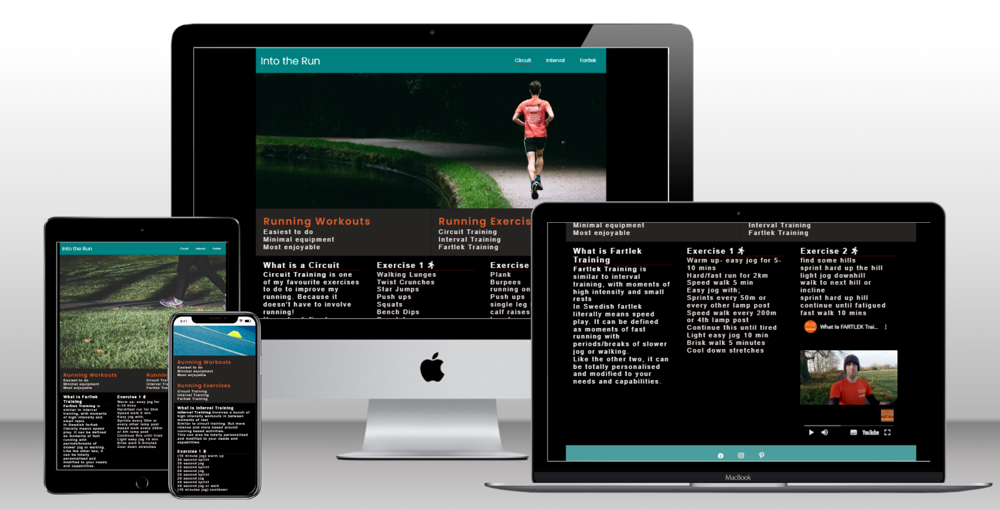
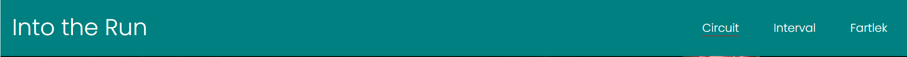
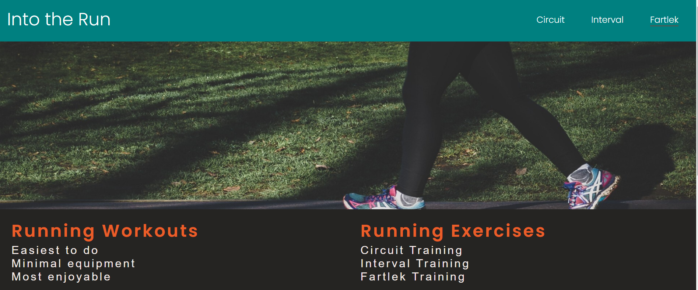
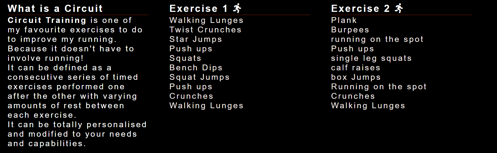
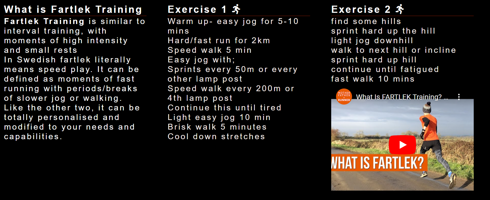

# Into The Run
[View Webpage Here](https://snoad96.github.io/portfolio-project-one/)

Into The Run is a project I have made to target non-runners and people intrested in getting started, and to explain easier or better ways than just "going for a run".

The three main points on this project are the perfect ways for anyone from any background to get into running or improve their running ability. Users of the site will learn about; 
#### __Circuit.__
#### __Interval.__
#### __Fartlek training.__

# Features

## Navigation

- Featured at the top right of the page is the logo.
- On the right side of the header are navigation links to the other pages on this site.
when hovered over they change and are interactive for the user.
- Depending on what page you are on, the navigation is underlined to show the user where they are.

## Images

Each page has its own respective image, keeping with the style and theme of the web page, I wanted to keep the images minimal to make sure the webpages didn't seem too cluttered or busy.

## Landing Page

- Each page has similar set up and information so it is easy for the user to figure out where the information is and where the examples of different exercises are for each page.

- Each page has the same information about the workouts, so the user can come to any page and knows similar information.

- Each page has an explanation of each type of exercise and what they are. There are also examples for each type of exercise so that the user can join in straight away! No planning needed.

### Fartlek

- On this page it explains what type of training this is.
- For a more in depth explanation, the user will be able to watch a fun video. 

## Footer

- The footer has icons and links for the user to easily reach the social media webpages for this website

## Features Left to Implement
- A questionnaire for the user to find out what type is preferred/more enjoyable.
- A page for links for good music playlists the user can train to.

## Testing

- I have tested the website on Chrome and Safari.
- I have tested the site on different screen sizes using mobile devices and Chrome Developer Tools.
- I have given the link to the site to different users to try on different devices.
- I have tested the links for all pages.
- The video does not play without user input.

## Bugs

- I struggled with screen sizing with the images as different sizes would change the image placement significantly.
- I fixed a bug where the video would not stay placed where it was meant to, this took some time.
- I overcomplicated the placement of the images initially, I had to remove a lot of rules and make it more simple.

## Validator Testing

#### HTML
- There were no errors found using the W3C HTML Validator.

#### CSS 
- There were no errors found using the W3C CSS Validator.

## Accessibility
- I have confirmed that the site has a good score through the use of the Chrome Lighthouse Tool.

### Unfixed Bugs
- All bugs have been fixed.

## Deployment

#### GitPod
- On the Gitpod site, 
     After making a few changes or writing more code on CSS or HTML files, go to the Terminal
     - Then deploy "git add ."
     - Deploy, "git commit -m "Brief description of what has changed/been added"
     - After any major code or changes, deploy "git push" 
     this pushes it to the GitHub Repository and can be seen on the files.

#### GitHub     
- The site is deployed by the use of GitHub Pages.
    - Using the GitHub Repository, click on the Settings tab.
    - From the source section menu, select the Master Branch.
    - A link will then be provided to the complete website.

    The Link to the Webpage is at the beginning of this page.

## Credits, Content and Media
- The images were taken from [Unsplash](https://unsplash.com/).
- The icons in the footer were taken from [Font Awesome](https://fontawesome.com/icons).
- The Video was taken from Youtube from [Mother Father Runner](https://www.youtube.com/watch?v=J6q5FWIvl-c).
- I recieved a lot of help going back through the Code Institute Videos, but also had a bit of help looking at [W3schools tutorials](https://www.w3schools.com/html/default.asp).

 
